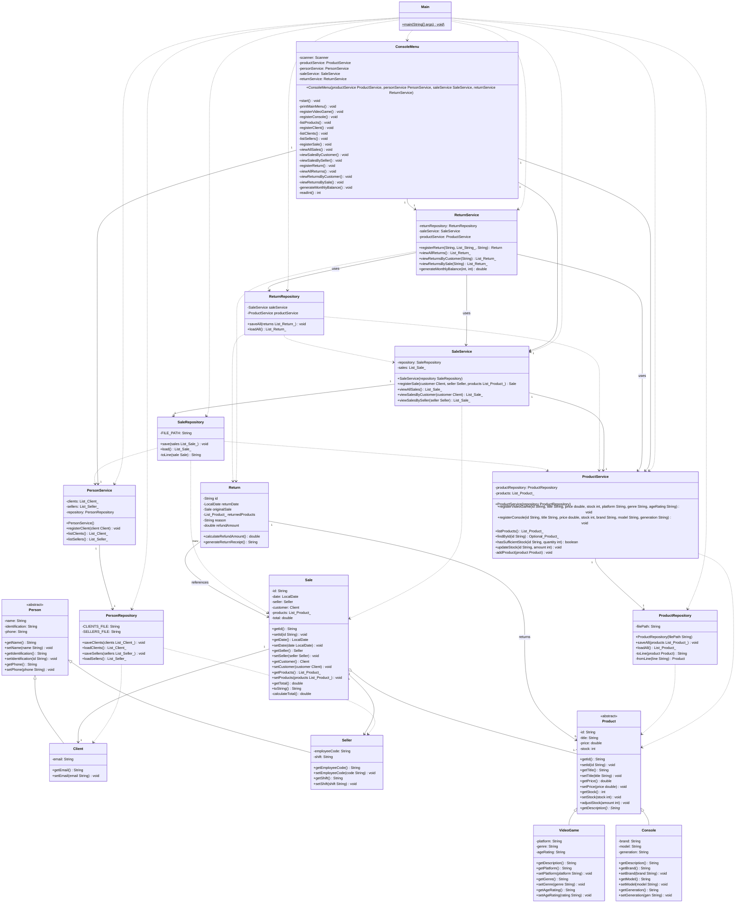

```mermaid
classDiagram
    %% ===== MODEL LAYER =====
    class Person {
        <<abstract>>
        -name: String
        -identification: String
        -phone: String
        +getName() String
        +setName(name String) void
        +getIdentification() String
        +setIdentification(id String) void
        +getPhone() String
        +setPhone(phone String) void
    }

    class Client {
        -email: String
        +getEmail() String
        +setEmail(email String) void
    }

    class Seller {
        -employeeCode: String
        -shift: String
        +getEmployeeCode() String
        +setEmployeeCode(code String) void
        +getShift() String
        +setShift(shift String) void
    }

    class Product {
        <<abstract>>
        -id: String
        -title: String
        -price: double
        -stock: int
        +getId() String
        +setId(id String) void
        +getTitle() String
        +setTitle(title String) void
        +getPrice() double
        +setPrice(price double) void
        +getStock() int
        +setStock(stock int) void
        +adjustStock(amount int) void
        +getDescription() String*
    }

    class VideoGame {
        -platform: String
        -genre: String
        -ageRating: String
        +getDescription() String
        +getPlatform() String
        +setPlatform(platform String) void
        +getGenre() String
        +setGenre(genre String) void
        +getAgeRating() String
        +setAgeRating(rating String) void
    }

    class Console {
        -brand: String
        -model: String
        -generation: String
        +getDescription() String
        +getBrand() String
        +setBrand(brand String) void
        +getModel() String
        +setModel(model String) void
        +getGeneration() String
        +setGeneration(gen String) void
    }

    class Sale {
        -id: String
        -date: LocalDate
        -seller: Seller
        -customer: Client
        -products: List_Product_
        -total: double
        +getId() String
        +setId(id String) void
        +getDate() LocalDate
        +setDate(date LocalDate) void
        +getSeller() Seller
        +setSeller(seller Seller) void
        +getCustomer() Client
        +setCustomer(customer Client) void
        +getProducts() List_Product_
        +setProducts(products List_Product_) void
        +getTotal() double
        +toString() String
        -calculateTotal() double
    }

    class Return {
        -String id
        -LocalDate returnDate
        -Sale originalSale
        -List_Product_ returnedProducts
        -String reason
        -double refundAmount
        +calculateRefundAmount() double
        +generateReturnReceipt() String
    }

    Person <|-- Client
    Person <|-- Seller
    Product <|-- VideoGame
    Product <|-- Console

    Sale "1" --> "1" Client
    Sale "1" --> "1" Seller
    Sale "1" o-- "1..*" Product
    Return "many" --> "1" Sale : references
    Return "1" --> "0..*" Product : returns

    %% ===== PERSISTENCE LAYER =====
    class ProductRepository {
        -filePath: String
        +ProductRepository(filePath String)
        +saveAll(products List_Product_) void
        +loadAll() List_Product_
        -toLine(product Product) String
        -fromLine(line String) Product
    }

    class PersonRepository {
        -CLIENTS_FILE: String
        -SELLERS_FILE: String
        +saveClients(clients List_Client_) void
        +loadClients() List_Client_
        +saveSellers(sellers List_Seller_) void
        +loadSellers() List_Seller_
    }

    class SaleRepository {
        -FILE_PATH: String
        +save(sales List_Sale_) void
        +load() List_Sale_
        -toLine(sale Sale) String
    }

    class ReturnRepository {
        -SaleService saleService
        -ProductService productService
        +saveAll(returns List_Return_) void
        +loadAll() List_Return_
    }

    ProductRepository ..> Product
    PersonRepository ..> Client
    PersonRepository ..> Seller
    SaleRepository ..> Sale
    SaleRepository ..> ProductService
    SaleRepository ..> PersonService
    ReturnRepository ..> Return
    ReturnRepository ..> SaleService
    ReturnRepository ..> ProductService

    %% ===== SERVICE LAYER =====
    class ProductService {
        -productRepository: ProductRepository
        -products: List_Product_
        +ProductService(repository ProductRepository)
        +registerVideoGame(id String, title String, price double, stock int, platform String, genre String, ageRating String) void
        +registerConsole(id String, title String, price double, stock int, brand String, model String, generation String) void
        +listProducts() List_Product_
        +findById(id String) Optional_Product_
        +hasSufficientStock(id String, quantity int) boolean
        +updateStock(id String, amount int) void
        -addProduct(product Product) void
    }

    class PersonService {
        -clients: List_Client_
        -sellers: List_Seller_
        -repository: PersonRepository
        +PersonService() 
        +registerClient(client Client) void
        +listClients() List_Client_
        +listSellers() List_Seller_
    }

    class SaleService {
        -repository: SaleRepository
        -sales: List_Sale_
        +SaleService(repository SaleRepository)
        +registerSale(customer Client, seller Seller, products List_Product_) Sale
        +viewAllSales() List_Sale_
        +viewSalesByCustomer(customer Client) List_Sale_
        +viewSalesBySeller(seller Seller) List_Sale_
    }

    class ReturnService {
        -returnRepository: ReturnRepository
        -saleService: SaleService
        -productService: ProductService
        +registerReturn(String, List_String_, String) Return
        +viewAllReturns() List_Return_
        +viewReturnsByCustomer(String) List_Return_
        +viewReturnsBySale(String) List_Return_
        +generateMonthlyBalance(int, int) double
    }

    ProductService "1" --> "1" ProductRepository
    ProductService ..> Product
    PersonService "1" --> "1" PersonRepository
    SaleService "1" --> "1" SaleRepository
    SaleService "1" --> "1" ProductService
    SaleService ..> Sale

    ReturnService --> ReturnRepository : uses
    ReturnService --> SaleService : uses
    ReturnService --> ProductService : uses
    ReturnService ..> Return

    %% ===== UI LAYER =====
    class ConsoleMenu {
        -scanner: Scanner
        -productService: ProductService
        -personService: PersonService
        -saleService: SaleService
        -returnService: ReturnService
        +ConsoleMenu(productService ProductService, personService PersonService, saleService SaleService, returnService ReturnService)
        +start() void
        -printMainMenu() void
        -registerVideoGame() void
        -registerConsole() void
        -listProducts() void
        -registerClient() void
        -listClients() void
        -listSellers() void
        -registerSale() void
        -viewAllSales() void
        -viewSalesByCustomer() void
        -viewSalesBySeller() void
        -registerReturn() void
        -viewAllReturns() void
        -viewReturnsByCustomer() void
        -viewReturnsBySale() void
        -generateMonthlyBalance() void
        -readInt() int
    }

    ConsoleMenu "1" --> "1" ProductService
    ConsoleMenu "1" --> "1" PersonService
    ConsoleMenu "1" --> "1" SaleService
    ConsoleMenu "1" --> "1" ReturnService

    %% ===== ENTRY POINT =====
    class Main {
        +main(String[] args) void\$
    }

    Main ..> ConsoleMenu
    Main ..> ProductRepository
    Main ..> PersonRepository
    Main ..> SaleRepository
    Main ..> ReturnRepository
    Main ..> ProductService
    Main ..> PersonService
    Main ..> SaleService
    Main ..> ReturnService
```
