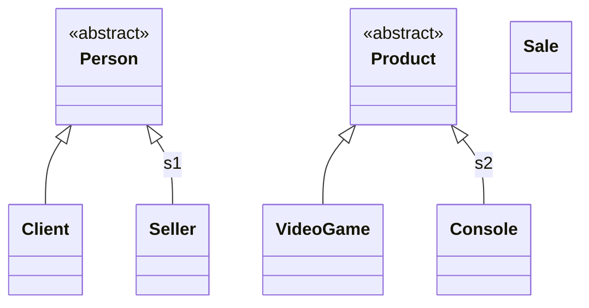

```mermaid
classDiagram
    class Person {
        <<abstract>>
    }
    class Client {
    }
    class Seller {
    }
    class Product {
        <<abstract>>
    }
    class VideoGame {
    }
    class Console {
    }
    class Sale {
    }

    Person <|-- Client
    Person <|-- Seller : s1
    Product <|-- VideoGame
    Product <|-- Console : s2
```
